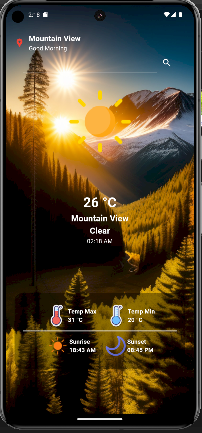
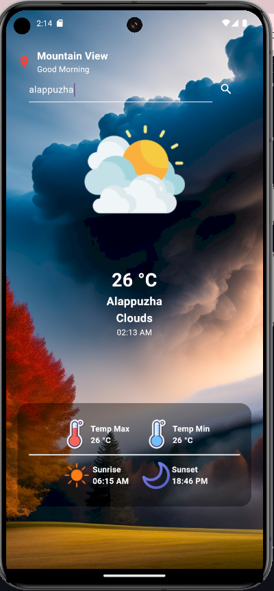

<!DOCTYPE html>
<html lang="en">
<head>
    <meta charset="UTF-8">
    <meta name="viewport" content="width=device-width, initial-scale=1.0">
    <title>Weather App</title>
</head>
<body>

<h1>Weather App</h1>

A Flutter weather application that provides current weather information based on the user's location or a specified city.

<h2>Features</h2>
<ul>
    <li>Fetches weather data using the OpenWeatherMap API.</li>
    <li>Displays current temperature, weather conditions, and city name.</li>
    <li>Shows sunrise and sunset times.</li>
    <li>Allows searching for weather data by city name.</li>
</ul>

<h2>Screenshots</h2>

    
    

<h2>Getting Started</h2>

<h3>Prerequisites</h3>
<ul>
    <li>Flutter SDK: <a href="https://flutter.dev/docs/get-started/install">Installation Guide</a></li>
    <li>An OpenWeatherMap API key: <a href="https://home.openweathermap.org/users/sign_up">Get API Key</a></li>
</ul>

<h3>Installation</h3>
<ol>
    <li>Clone the repository:
        <pre><code>git clone https://github.com/yourusername/weatherapp.git</code></pre>
    </li>
    <li>Navigate to the project directory:
        <pre><code>cd weatherapp</code></pre>
    </li>
    <li>Install dependencies:
        <pre><code>flutter pub get</code></pre>
    </li>
    <li>Run the application:
        <pre><code>flutter run</code></pre>
    </li>
</ol>

<h3>Configuration</h3>

Create a file named <code>.env</code> in the root directory of the project and add your OpenWeatherMap API key:

<pre><code>API_KEY=your_api_key_here</code></pre>

<h2>Usage</h2>
<ol>
    <li>Open the app, and it will automatically fetch the weather data for your current location.</li>
    <li>To search for weather data in a different city, enter the city name in the search bar and press the search icon.</li>
</ol>

<h2>Packages Used</h2>
<ul>
    <li><a href="https://pub.dev/packages/provider">Provider</a>: Used for state management. Helps manage the app's state and allows for efficient data sharing across widgets.</li>
    <li><a href="https://pub.dev/packages/geolocator">Geolocator</a>: Provides location services, including getting the user's current location.</li>
    <li><a href="https://pub.dev/packages/geocoding">Geocoding</a>: Converts addresses into geographic coordinates (latitude and longitude) and vice versa, useful for location-based features.</li>
    <li><a href="https://pub.dev/packages/intl">Intl</a>: Used for date and time formatting, ensuring that dates and times are displayed in a user-friendly manner.</li>
    <li><a href="https://pub.dev/packages/http">Http</a>: Allows making network requests to fetch data from APIs, such as the OpenWeatherMap API.</li>
</ul>

<h2>Contributing</h2>

Contributions are welcome! Please fork the repository and submit a pull request.

<h2>License</h2>

This project is licensed under the MIT License - see the <a href="LICENSE">LICENSE</a> file for details.

</body>
</html>
